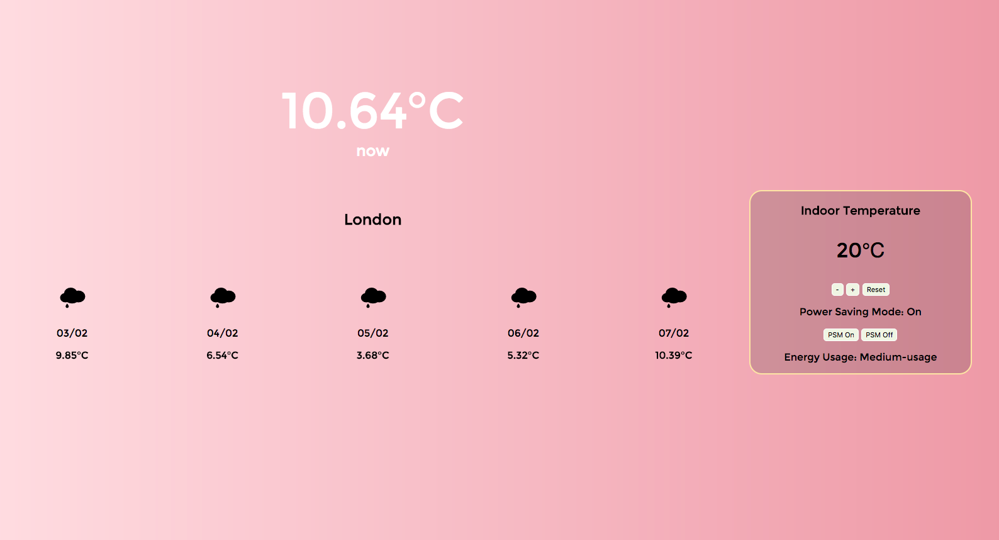

# Temperature

A practice project to display 5 days weather forecast. User can also interact with an indoor thermostat. Built with HTML, CSS and JavaScript, tested with Jasmine.

## Installation

In the terminal, run:
1. git clone git@github.com:lcbeh/temperature.git
2. open index.html
